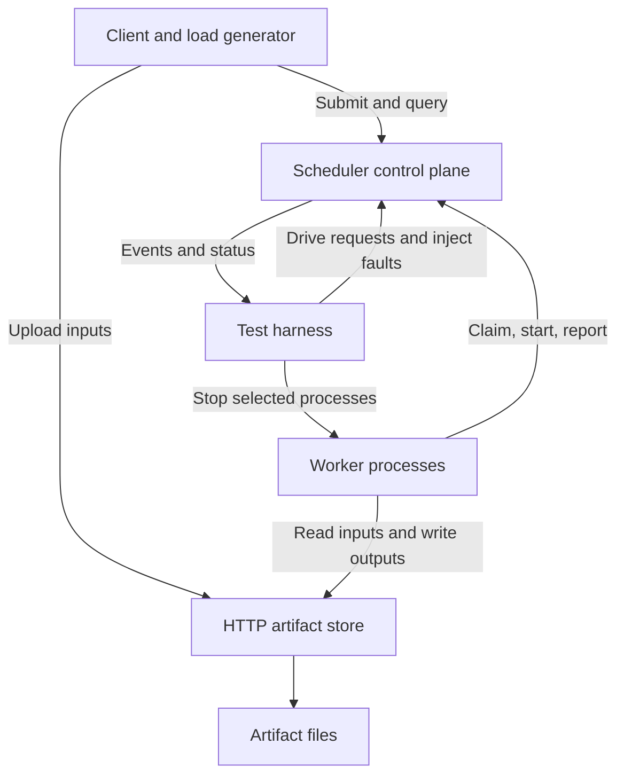
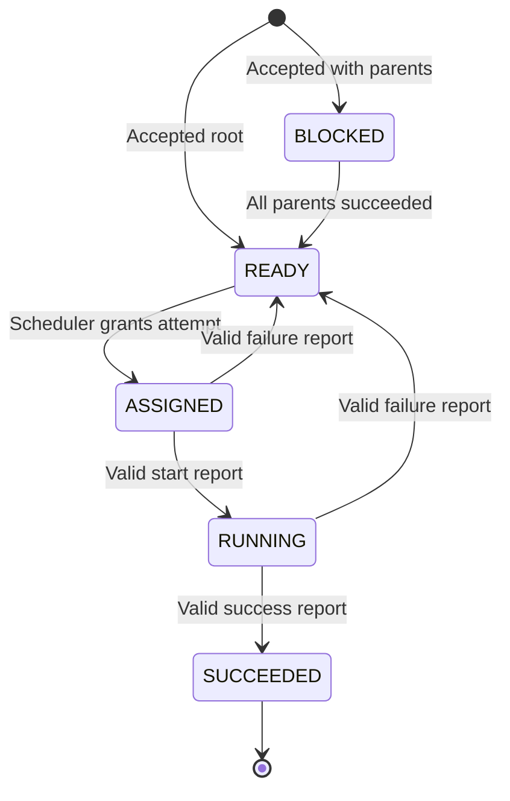

# CS4094 MS2 Architecture and Implementation Contract

Architecture recommendation for the fault-tolerant distributed DAG task scheduler. No project implementation is included. Correctness statuses below are implementation targets, not measured results.

## Source authority and decisions

Use the sources in this order:

| Label | Source and location | Authority |
|---|---|---|
| A | `cs4094_f26_project_guidelines_v20260824.pdf`, MS2/MS3/MS4 on pp. 2-3 and software artifact on p. 7 | Governing assignment |
| P | `CS4069 (1).pdf`, p. 1 | Approved project specification |
| D | `ms1_proposal_deck (1).pptx`, especially slides 1, 3-5 | Supporting ideas |
| L2 | `CS4094 F26 L2_ System Models.pdf`, especially pp. 44-69 | Network, node, timing, and failure-detector terminology |
| L3 | `CS4094 F26 L3_ Hokea Lab.pdf`, Hokea/lab portion | Course deployment guidance |
| L4 | `CS4094 F26 L4_ Time, Clocks, and Lies.pdf`, especially pp. 36-42 | Clock guidance |
| L5 | `CS4094 F26 L5_ Replication.pdf`, pp. 2-3 | Hokea orchestration and storage caveats |
| L6 | `CS4094 F26 L6_ Consensus.pdf`, p. 5 | Retry semantics and duplicate handling |
| R | This document | New recommended engineering decisions |

P does not require scheduler failover, replicated scheduling state, paid transcription, or exactly-once external effects. D proposes durable scheduler state, leases, and fencing tokens. These are optional mechanisms, not stronger approved guarantees. Its paid-API slogan must not enter the specification as a guarantee.

The guidelines contain a weekday/date mismatch for MS2. L6 p. 2 announces an extension. Submission timing should follow the current Canvas assignment; this document does not establish a deadline.

**Recommendation:** implement one scheduler, polling workers, a small HTTP artifact store, atomic in-process state changes, and logical-task completion deduplication. Intentionally omit reclamation of work from silent/crashed workers. Fix that in MS3 by adding lease expiration to the existing attempt model.

## 1. Requirements interpretation

### MUST implement for MS2

- **A:** All planned functionality on the happy path, an automated violation of an approved correctness claim, initial performance characterization, reproducible deployment, revised specification, and a progress report.
- **P:** Client submission of DAG jobs, one scheduler, multiple workers, dependency tracking, assignment of ready tasks, execution, completion reports, and job status.
- **R:** Correct DAG validation, task identity, atomic assignment, branch parallelism, valid completion acceptance, completion deduplication, and a simple retry after an explicitly reported execution failure.
- **R:** A concrete video-file demonstration using simple operations. This follows the advisory feedback and realizes P's scenario without implementing a video-sharing platform.
- **R:** Unit and integration tests, one real crash fault test, structured evidence, and benchmark scripts. Documentation must distinguish intended semester claims from current MS2 behavior.

### SHOULD implement to prevent MS3 debt

- Immutable job manifests, separate logical-task and attempt identities, ownership validation, and an operation allowlist.
- A scheduler core independent of HTTP, an in-memory state-store implementation behind a narrow command boundary, and an injectable monotonic clock.
- Stable artifact references and isolated output namespaces for attempts.
- A transport-independent harness for process termination and event collection.
- Cached results for retried mutating requests during a scheduler run.

These SHOULD items are adopted in this recommended implementation contract because each is small and prevents a specific later rewrite.

### Deliberately defer

Automatic reassignment after silence, leases and renewal, failure detectors, worker-crash task recovery, comprehensive network-fault campaigns, durable scheduler restart recovery, replication, and scheduler failover. Also defer terminal task-failure policy, priorities, scheduling optimization, cancellation, external paid APIs, authentication, a web UI, and production media algorithms.

Implementing explicit failure reports now does not imply that silent failures are recovered.

## 2. Architecture

**Stack, R:** Java 21, a Maven multi-module build, JDK `HttpServer`/`HttpClient`, Jackson for JSON, and JUnit for unit tests. Use Python 3.12 with pytest for orchestration and black-box tests. FFmpeg/ffprobe run only inside workers. Pin concrete dependency and container versions when implementation begins, and record them in the repository. A framework, message broker, database, or Kubernetes operator is unnecessary for this milestone.

The JDK HTTP server supports handlers and an explicit executor, which fits this small service boundary [W1]. The worker loop and all scheduling rules are independent of that transport.

| Component | Responsibility |
|---|---|
| Client | Upload inputs, submit an explicit DAG manifest, query status, fetch final artifacts. Retry submission with the same job ID. |
| Scheduler | Validate DAGs, maintain authoritative task/job/attempt state, resolve parent outputs, select ready work, validate ownership, accept results, release dependencies, and record events. |
| Worker | Poll, acknowledge start, execute one bounded allowed operation, upload completed outputs, then report success or failure. Execute at most one attempt at a time. |
| Artifact store | PUT/HEAD/GET immutable objects. Store files and expose an object only after its complete upload. It knows nothing about dependencies or task success. |
| State store | Memory implementation used only by the scheduler core. It groups a command's state changes and events atomically. No MS2 database. |
| Test harness | Deploy isolated runs, drive valid and invalid requests, collect event histories, stop workers, and verify predicates. |
| Benchmark driver | Maintain a defined number of jobs in flight and export raw and summarized measurements. |

The artifact store is a separate data-plane service because workers on different machines must exchange outputs without assuming a shared filesystem. Its availability and storage integrity are assumptions, outside the worker-fault claim. The only test-only simulation is a controlled worker pause/error hook. Subtitle generation uses a clearly labeled fixture file, not a simulated paid API.

## 3. DAG model

### Identities and records

| Record | Conceptual fields |
|---|---|
| Job manifest | Schema version, client-generated UUID `job_id`, ordered task definitions, explicit final output bindings. Immutable after acceptance. |
| Task definition | Job-local `task_id`, operation type, validated parameters, parent ID set, named input bindings, expected output names. |
| Task runtime | State, satisfied parent set, latest attempt number, current owner, accepted completion, readiness timestamp. |
| Attempt | `(job_id, task_id, attempt_no)`, worker session UUID, assignment/start timestamps, status, report receipt, error or outputs. |
| Worker session | Fresh UUID at each process start, optional display name, active attempt, request receipts. |
| Artifact reference | Object key, byte length, SHA-256, media type. Resolve through configured artifact-store URL. |

Logical identity is `(job_id, task_id)` and never changes on retry. `attempt_no` starts at 1 and strictly increases for each new execution assignment. A worker session is an incarnation, not a reusable hostname. Generate a random `scheduler_run_id` at startup and include it in responses, mutations, events, and output namespaces. Reject messages for another run.

### Dependencies and inputs

Dependencies are a set of predecessor task IDs within the same job. Build both parent and child adjacency lists. A named input binds either an uploaded source artifact or a named output of a parent. Any parent-output binding must name a declared parent and declared output. An ordering-only dependency is permitted. Parent-output bindings resolve to that parent's accepted output, never to a guessed filename or most recent file on disk.

Reject empty DAGs, duplicate task IDs, unknown parents, self-edges, cycles, repeated dependency IDs, invalid output/input bindings, and unsupported operations. Use a topological validation pass. Initial limits: 128 tasks/job, 512 dependency edges/job, 1 MiB manifest, and 32 MiB per artifact. These are R limits, not course requirements. Reject an over-limit request explicitly.

Source artifacts must exist before submission. Check references outside the scheduler lock and revalidate the immutable manifest inside the acceptance command. Artifact-store unavailability produces a transient error without accepting the job.

### Readiness and completion

For a task with parent set P, readiness means every parent is logically `SUCCEEDED`. Roots are ready immediately after acceptance. Maintain the satisfied parent set to make duplicate parent messages harmless. Enqueue a task once when its readiness predicate becomes true.

The job succeeds only when every task succeeds. Designated final outputs are a convenience for fetching results; they do not permit unfinished tasks elsewhere in the DAG. Multiple roots and sinks are supported.

Source objects use `inputs/<asset_uuid>/<name>`. Output objects use `runs/<run_id>/jobs/<job_id>/tasks/<task_id>/attempts/<n>/<output_name>`. Path components use a restricted identifier alphabet with no separators or traversal. Accepted completion determines which attempt's outputs downstream tasks read.

## 4. Task state machine

Use five logical-task states. Track attempt failure separately.

| Transition | Actor and atomic effect |
|---|---|
| Creation to BLOCKED/READY | Scheduler acceptance command creates the complete graph and enqueues roots. |
| BLOCKED to READY | Scheduler accepting the last unsatisfied parent's success marks the task ready and appends it to the FIFO. |
| READY to ASSIGNED | Scheduler claim command removes it from the FIFO, increments attempt number, and installs owner and active-attempt mappings before responding. |
| ASSIGNED to RUNNING | Scheduler accepts a matching start report. Worker executes only after the acknowledgment. |
| RUNNING to SUCCEEDED | Scheduler accepts a matching success report with complete expected outputs. Stores the single accepted completion, releases ownership, satisfies child edges, and updates the job in one command. |
| ASSIGNED/RUNNING to READY | Scheduler accepts a matching explicit failure report, marks that attempt FAILED, releases ownership, and requeues the logical task at the tail. |

Duplicate start/success/failure receipts produce no new transition. An assignment acknowledgment, worker silence, file existence, timeout, or worker restart cannot mark success. Reject BLOCKED-to-ASSIGNED, success before RUNNING, success from another owner/attempt/run, and all attempts to change a successful task.

Attempt status is ASSIGNED, RUNNING, SUCCEEDED, or FAILED. MS3 may add EXPIRED for a lease that expires. No transition from ASSIGNED/RUNNING to READY on silence exists in MS2. That absence is the deliberate liveness defect.

No scheduler state must survive a scheduler failure under the selected MS2 scope. Outputs survive a worker process failure if the artifact store stays up. A worker keeps only its active attempt and report in memory. Loss of that state explains why a restart does not recover its old task.

## 5. Job state machine

| State | Meaning and transition |
|---|---|
| ACCEPTED | Valid manifest stored and roots ready. |
| RUNNING | First assignment issued. Remains here through task retries and idle/stalled periods. |
| SUCCEEDED | Every task SUCCEEDED and final references stored. Terminal. |

Only the scheduler changes job state. Rejected submissions never become jobs. A stalled job remains RUNNING with diagnostic counts and owners; do not report it as successful, failed, or cancelled.

Do not introduce a retry limit or a terminal FAILED job in MS2. Explicit operation failures are retried while service and workers remain available. A permanently failing operation can prevent job success; P promises assignment and retry, not success of an operation that always fails. A final terminal-error policy needs a later explicit specification decision.

## 6. Communication and API boundaries

Use JSON over HTTP/1.1, short polling, and HTTP streaming for object bytes. The scheduler never pushes work. Worker containers need no inbound production port. This avoids subscriptions, broker acknowledgments, discovery, and streaming reconnection logic.

| Endpoint | Request and behavior |
|---|---|
| GET `/v1/health` | Readiness and current scheduler run ID. |
| POST `/v1/jobs` | Manifest with job UUID. 201 for first acceptance, 200 for identical replay, 409 for the same ID with different normalized content. Returns status and run ID. |
| GET `/v1/jobs/{job_id}` | Atomic snapshot of job/tasks, attempt owners/history, outputs, counts, and snapshot event sequence. 404 for unknown job in this run. |
| POST `/v1/work/claim` | Run ID, session UUID, fresh `claim_id`. 200 assignment, or 204 no work. An identical claim replay returns the cached result without a new assignment. |
| POST `/v1/attempts/start` | Run/job/task/attempt/session identity. 200 accepted or identical replay; 409 invalid owner/state/attempt. Response supplies the scheduler event sequence. |
| POST `/v1/attempts/report` | Identity, SUCCESS or FAILURE, named output descriptors or structured error. 200 accepted or identical replay; 409 conflict or stale attempt. |
| GET `/v1/events?after={seq}&limit={n}` | Scheduler events in sequence order, maximum 1000 per page. Returned cursor and run ID. Read-only evidence interface. |
| GET `/v1/metrics` | JSON counters, state gauges, and scheduler-local timing summaries. |
| PUT `/v1/objects/{key}` | Artifact bytes, declared length and SHA-256. 201 new object, 200 identical replay, 409 existing key with different bytes. |
| HEAD/GET `/v1/objects/{key}` | Descriptor or completed bytes, 404 before publication. Artifact service also provides health. |

Malformed or unsupported input is 400; limits are 413; unavailable storage/overload is a transient 503. Error bodies contain a machine-readable error code. No mutation occurs on a rejected scheduler command.

### Exact message retry rules

- Submission retries retain the job ID and immutable normalized manifest.
- A claim cycle has one `claim_id`; transport retries retain it. After a successful no-work reply or a completed attempt, the next cycle gets a new ID. Keep claim receipts for the run. If its assignment has become terminal, a replay identifies that terminal disposition and provides no instruction to execute it again.
- A session with an active attempt receives that same attempt on a new claim, rather than owning another task. An honest worker makes no new claim while running or waiting for a report acknowledgment.
- Start and report retries preserve the full identity and exact normalized body. Save an immutable report receipt for each finished attempt. Replays cannot release dependencies or requeue twice.
- After uploading outputs, retry the success report until accepted, rejected as stale, or the scheduler run changes. A lost acknowledgment causes a repeated report, not repeated execution.
- Poll interval: 100 ms after a successful no-work reply. HTTP connect timeout: 2 seconds. Request timeout: 5 seconds. Transient retry backoff: 100 ms, 200 ms, 400 ms, then 1 second capped. These tune experiments; none establish worker failure.

Use a normalized typed manifest for submission equality: dependency sets and task maps compare semantically, numeric/string types and operation parameters remain significant, and array order remains significant where the operation gives it meaning. Do not compare raw JSON whitespace.

The worker loop is claim, start acknowledgment, bounded operation, upload, report acknowledgment, then claim again. Default operation timeout is 30 seconds with an explicit failure report on local timeout. On stale identity, stop reporting/executing that attempt and retain diagnostics. On a changed scheduler run, discard the old assignment and start a new session. Never resume an old assignment into a new run.

## 7. Concurrency model

Use a single global scheduler mutex for all logical state changes and snapshot reads. HTTP handlers may run concurrently in an explicitly configured executor, but each scheduler command runs atomically. For this scale, that is simpler than per-task locks and makes the invariant boundary obvious.

Configure 16 HTTP handler threads per server and a 128 MiB JVM heap inside the 512 MiB service limit. Parse requests and perform network/file I/O outside the mutex. A success handler checks expected immutable output descriptors against artifact-store HEAD responses outside the lock, then rechecks task/attempt/owner/state while holding it. A concurrent failure report can therefore invalidate a success before commit. No scheduler lock is held while executing media operations, contacting workers/storage, writing HTTP bodies, or exporting logs.

Within one completion command, atomically record success, clear ownership, mark each dependency edge satisfied, enqueue newly ready tasks, update job completion, and append decision events. The accepted result is the authoritative decision.

| Situation | Required behavior |
|---|---|
| Multiple simultaneous claims | One claims a ready task and removes it under the lock. The next observes that assignment and chooses another task or no work. |
| Many tasks become ready | Append once in deterministic task-ID order for tasks released by the same command. Assign monotonically increasing ready sequence numbers. |
| Independent branches | Assigned to separate worker sessions and execute outside the scheduler concurrently. |
| Duplicate successful report | Acknowledge the stored receipt, produce a duplicate-message diagnostic, and leave success count, outputs, children, and job state unchanged. |
| Late report from a failed older attempt | Acknowledge an exact replay of that attempt's stored failure receipt; reject any new success or conflicting report as stale/conflicting. |
| Conflicting report after success | Reject. The successful task is terminal. |
| Worker disappears | Keep the attempt owned and stuck. Other ready work continues. This is deliberately unresolved in MS2. |

FIFO over a finite queue avoids starvation of earlier ready tasks. Requeued tasks go to the tail. Assuming admitted load is finite or does not indefinitely exhaust service capacity, available workers polling and eventual message delivery lead to assignment. There is no general latency or fairness promise under unlimited overload.

## 8. Formal distributed system model

L2 separates network behavior, node behavior, and timing assumptions. Use those terms rather than calling the system simply unreliable or asynchronous.

| Dimension | MS2 | Intended semester direction |
|---|---|---|
| Network | Fair-loss point-to-point application communication: requests/responses can be lost, delayed, duplicated, or reordered across requests. Honest endpoints, no message forgery. Happy-path tests use stable delivery; basic replay handling works within a live process. | Same fair-loss model, with explicit delay/loss/partition tests and eventual successful retries after temporary disruption. |
| Worker nodes | Physical crash-recovery: a process may stop and return with volatile state lost. Each return has a new session. A permanent crash is also permitted. Recovery of owned tasks is intentionally incomplete. | Reclaim unfinished work from crashed/restarted/unavailable workers. No worker-local durable execution journal is required for this approach. |
| Scheduler node | Single correct process assumed for the lifetime of a run. A crash ends that run; restarting creates a different empty run. No crash-tolerance guarantee. | Keep this as the baseline unless an explicit scope decision adds durable restart recovery. Replicated failover is a separate extension. |
| Artifact store | Correct and available during the run. Completed objects immutable. Store crash, disk loss, and corruption are outside the claims. | State this assumption explicitly unless separately expanded. |
| Timing | Partially synchronous operating environment. Safety does not depend on bounded delay or synchronized wall clocks. Happy-path progress assumes eventual delivery, fair scheduling, and bounded successful operations. | Lease-based progress requires an eventual interval in which timeout/renewal settings are adequate and some workers can finish. Timeouts indicate suspicion. |

Do not promise progress during a permanent partition or if all workers remain unavailable. Adding a fixed lease alone does not prove liveness for arbitrarily long tasks: the eventual lease duration/renewal policy must let a surviving worker complete. An asynchronous safety discussion can allow arbitrary delay; it cannot imply a bounded recovery guarantee.

Monotonic clocks measure scheduler-local elapsed time and later lease deadlines. Wall-clock timestamps are for humans. Never subtract timestamps from different machines to establish ordering or latency. Cross-node causality is established by IDs and scheduler acknowledgments. L4 motivates this separation, and `System.nanoTime()` provides JVM-local elapsed-time measurement [W2].

## 9. MS2 correctness status

These classifications describe the recommended prototype when implemented and tested. They are not claims that this architecture document already proves an existing artifact.

| Approved P claim | Status | Reason and falsification test |
|---|---|---|
| A task is not marked complete unless successful completion is reported. | Satisfied in MS2 scope | Only the valid success command can set SUCCEEDED. Assignment, a start, a failure, silence, or an uploaded file cannot. Test each negative case and output publication before success. Honest worker operation success is a stated assumption, not independent computation verification. |
| A task does not run before required dependencies finish. | Satisfied in MS2 scope | Only ready tasks are assigned; workers wait for the start acknowledgment; bindings reference accepted parent outputs. Check scheduler event order and actual worker operation-start causality. |
| Retried tasks are not recorded as multiple successful completions. | Satisfied in MS2 scope | Logical identity survives retries, SUCCEEDED is terminal, and the atomic command accepts one success. Exercise a real explicit-failure retry and replay reports, not only a no-retry task. This holds during one scheduler run. |
| While workers remain available, every ready task eventually gets assigned and completes or is retried after failure. | Partially satisfied | FIFO assignment and explicit reported-failure retries work on the happy path. A crash after assignment can prevent completion or retry. |
| An unfinished task of a worker that fails eventually becomes available for reassignment. | Intentionally not yet satisfied | There is no lease, expiry scan, or silent-owner release. The primary automated fault test demonstrates this violation. |

The last two rows are overlapping liveness consequences of one missing mechanism. Do not invent an additional primary failure just to give them different demonstrations. The revised specification must retain the intended P claims and clearly mark these current gaps.

## 10. Exactly one primary failing property

**Property L2: an unfinished task owned by a failed worker eventually becomes available for reassignment.**

This choice postpones the substantial MS3 problem of distinguishing silence from failure, expiring ownership safely, and accepting/rejecting late results. It preserves safety and provides a direct extension to the existing attempt state machine. Deliberately allowing duplicate success would instead damage dependency accounting and the foundation of the prototype.

### Automated test: `worker_crash_reassignment`

1. Start a fresh scheduler and artifact service with no old state. Start worker A only.
2. Submit job J with task X and dependent task Y. X uses a valid fixture operation. Configure A's test-only pause inside that operation, after its successful start acknowledgment and `worker_operation_started` event but before producing/uploading outputs.
3. Await the structured `worker_test_gate_entered` event for X, correlated with scheduler `task_started` and the worker's operation-start event. Confirm X is RUNNING, owned by A, with no accepted success or outputs. This is an event barrier, not an arbitrary sleep.
4. Send a hard kill to A and record the process/session/task/attempt and harness fault timestamp. Confirm process exit and do not restart it.
5. Start worker B, without the gate. Submit independent probe job P. Require P to succeed. Confirm B continues making claim requests and receiving no work after the probe. This establishes available workers and a live scheduler/storage path.
6. With no other injected fault and no overload, wait up to 10 seconds for X to be assigned to B with a higher attempt number. If that happens, allow J to finish and collect its history.
7. The test's correct-behavior assertion requires reassignment to B in that controlled window. In MS2 it fails: X remains RUNNING under the dead A, Y remains BLOCKED, and J remains RUNNING.

Capture status snapshots, scheduler events, A's gate event, the kill/exit record, B's claim records, the probe result, and the assertion traceback. Assert safety alongside the demonstration: no false success, no early start of Y, and at most one success for X.

The 10-second window is a test budget for a controlled experiment, not P's universal liveness bound. A finite wait alone cannot prove permanent failure. The structural explanation is that the only MS2 outgoing transitions for that owned attempt require a report from A, and A is stopped. B's claims cannot release A's ownership.

### Reporting the known failure honestly

`make fault-demo` runs this test with pytest `--runxfail` and returns a nonzero status in MS2. Save its failed assertion as milestone evidence. The normal `make test` runs it with a strict expected-failure marker whose permitted failure is a dedicated `RecoveryNotObserved` exception raised only by the final recovery oracle. Setup, container, probe, and safety errors must fail normally. Assert exactly one XFAIL and no unexpected failures. An XPASS must fail the MS2 acceptance suite until the scope/status is consciously updated. pytest documents strict expected failures and `--runxfail` [W3].

When MS3 adds leases, remove the expected-failure marker and keep the same test as a passing regression. Do not replace it with a test asserting that getting stuck is correct.

## 11. Persistence

**MS2 scheduler state is in memory.** P's fault model names workers, not scheduler crashes. D's on-disk state is an optional idea. Neither durable scheduler recovery nor failover is necessary to fix the selected worker-crash property while the scheduler remains alive.

| Information | Storage and guarantee |
|---|---|
| Jobs, manifests, task/attempt state, owners, ready queue, completion receipts, claim receipts | Scheduler memory for one run. Lost on scheduler restart. |
| Ready sequence, satisfied parent sets, event history | Same memory and atomic command boundary. |
| Source and output artifact bytes | Artifact-service directory mounted as a local volume for reproduction. Retain files after worker death. No store restart/host-loss guarantee. |
| Exported JSONL, snapshots, benchmark CSV, reports | Saved evidence files for human review and reruns. Never replay logs as scheduler recovery state. |
| Worker current attempt and pending report | Worker memory. Lost on restart. |

Artifact PUT stages bytes in a temporary file, checks length/hash, closes the file, then publishes a completed immutable object in the service's object index. GET/HEAD consult that index, so partial upload files are never visible as complete objects. Serialize publication per key, and treat a conflicting PUT as an error. There is no MS2 promise of power-loss durability or service restart reconstruction. Orphan staging files are ignored.

State-store boundary: a scheduler command reads authoritative records and applies its updates plus event append atomically. Keep graph validation, readiness, ownership checks, and legal transitions in the domain core. Memory is the only required backend. A later SQLite backend can persist the same records using a transaction, without pretending logs alone provide recovery.

If scheduler restart is later added, durable manifests, attempt counters, completions, ready eligibility, request receipts, and transaction atomicity are required. Define scheduler incarnation changes and in-flight reconciliation before making that claim. A local database does not provide scheduler availability, leader election, or replicated failover.

## 12. Workloads

### Functional workload

Use small canonical UTF-8 JSON/text artifacts and allowed fixture operations.

| Task | Parents | Operation and expected output |
|---|---|---|
| A | None | Write integer 3. |
| B | A | Add 4: 7. |
| C | A | Multiply by 5: 15. |
| D | B, C | Sum: 22. |
| E | D | Format the exact text `result=22` followed by a newline. |

B and C test independent branches; D tests a join; E verifies propagated data. Fixture operations have an optional validated delay, default 100 ms, and fixed typed parameters. Do not accept arbitrary source code or shell commands in a task manifest. Tests also cover multiple roots, multiple sinks, and disconnected valid subgraphs.

For a real retry test, configure a worker test hook to report a controlled failure on attempt 1 before writing outputs. Attempt 2 must execute and finish with exactly one logical success. Test hooks are disabled in regular deployment and do not affect production scheduling decisions.

### Video demonstration workload

Commit a small redistributable/project-owned MP4 and matching fixture SRT. Recommended sample: roughly 10 seconds, 1280x720, with recorded SHA-256 and provenance. No runtime download is required. If a real sample cannot be supplied, a generated FFmpeg sample is a runnable fallback and must be labeled synthetic; the intended demo still uses actual video-file operations. FFmpeg documents test sources and scaling filters [W4].

| Task | Parents | Work |
|---|---|---|
| inspect | None | ffprobe the uploaded video; write metadata JSON. |
| transcode720 | inspect | Read the original video and produce a 720p MP4. |
| transcode360 | inspect | Read the original video and produce a 360p MP4. |
| thumbnail | inspect | Read the original video and extract one PNG frame. |
| subtitles | inspect | Copy the provided fixture transcript to the output SRT. Label this fixture subtitle generation. |
| publish | All four branches | Create a manifest containing accepted MP4/PNG/SRT references and metadata. |

Publishing means publishing an artifact manifest, not deploying a public video platform. Every operation has defined output names, a 30-second local timeout, and a checked exit/result status. Limit FFmpeg threads to one and use a fixed software codec/preset. A demo test verifies readable outputs, dimensions, and manifest references rather than relying on fragile byte equality of transcoded video.

## 13. Performance experiment

Measure **job completion time, task throughput, and scheduling latency**, all named in P. Defer recovery time until work can actually be recovered. Do not report the 10-second fault-test observation as a finite recovery measurement.

Use a synthetic six-task DAG A, three branches B/C/D, join E, and final task F. Each allowed fixture operation waits 100 ms and transforms a small deterministic value. A=1; B/C/D add 1/2/3; E sums their outputs to 9; F formats the result. Artifacts remain tiny. This characterizes scheduler coordination and parallel bounded waiting, not codec or CPU scaling.

| Parameter | Exact design |
|---|---|
| Primary independent variable | Concurrent in-flight jobs C = 1, 4, 16. |
| Secondary variable | Worker count W = 1, 2, 4. One execution slot/worker. |
| Configurations | All nine C/W combinations. |
| Measured load | 24 jobs/configuration/run, 6 tasks/job, 144 logical tasks. Closed-loop driver keeps at most C jobs in flight and replaces completed jobs until 24 are submitted. |
| Warmup | 4 jobs before each measured run, excluded from results. JVMs remain up between that warmup and measurement. |
| Repetitions | 5 independent measured runs per configuration. Start a new scheduler/worker run each repetition, then warm it up. |
| Faults | None in benchmark runs. |
| Run timeout | 120 seconds for the measured phase. Record failures/censored runs explicitly. |
| Resource settings | Scheduler/store/worker each capped at 1 CPU and 512 MiB; one worker slot; bounded JVM heap; record host capacity and actual image versions. |

Job completion time is scheduler acceptance to the all-tasks-success decision, measured on the scheduler's monotonic clock. Task throughput is accepted logical successes divided by the batch interval from first measured job acceptance to last measured job completion, also on the scheduler. Scheduling latency is READY to ASSIGNED on that same clock. Record initial-attempt latency here; benchmark faults/retries are disabled. Polling latency is part of the measured scheduling behavior.

Export per-job completion times and per-task ready/assigned/success durations, plus run metadata and batch throughput. Summarize p50/p95 per configuration, throughput mean and spread across repetitions, and incomplete/error counts. Do not sum polling responses or duplicate reports as completed tasks. Keep run-level values rather than treating correlated tasks as independent benchmark repetitions.

Report the shared-host and synthetic-wait limitations. No speedup or numeric target is promised. The progress report should describe observed bottlenecks only after running the experiment.

## 14. Observability

Each event has schema version, scheduler run ID, event type, producer, producer-local sequence, UTC timestamp, local monotonic elapsed timestamp, request ID, and applicable job/task/attempt/session IDs. Scheduler decision events additionally have a strictly increasing `scheduler_event_seq`, old/new task state, and causal references such as parent ID or report receipt. Never compare elapsed clocks across processes.

| Event | Exact meaning |
|---|---|
| job_submitted | Acceptance command committed the manifest. |
| task_ready | Readiness became true and the task entered the FIFO; include ready sequence and satisfied parents. |
| task_assigned | Ownership and attempt record installed. |
| task_started | Scheduler accepted matching start; acknowledgment precedes the worker operation. |
| worker_operation_started | Worker begins executing after start acknowledgment; include its acknowledged scheduler event sequence. |
| task_succeeded | Single logical success accepted, with output descriptors. |
| task_failed | Matching explicit failure accepted; include attempt error. |
| task_retried | An attempt numbered greater than 1 was assigned; reference earlier failed attempt. |
| dependency_satisfied | One child/parent edge becomes satisfied exactly once. |
| job_completed | All task successes committed. |
| completion_duplicate / report_rejected | Replay or rejected input, without a success transition. |
| work_claim / work_empty | Diagnostics establishing worker availability and polling. |
| worker_test_gate_entered / fault_injected | Test-only barrier and harness fault evidence. |

Append scheduler decision events with the state change under the mutex. Keep the full run history in memory, expose it through the paginated event endpoint, and drain it to JSONL in sequence order outside the mutex. Logs are evidence, not a durable journal. At test/benchmark end export all events and an atomic status snapshot before teardown. Unexpected event loss is a harness failure.

Counters: accepted jobs, accepted logical successes, explicit failed attempts, retries assigned, duplicate reports, rejected reports. Gauges: tasks by state, ready queue length, active attempts. Timing samples: scheduler job durations and ready-to-assigned latencies. MS2 needs neither Prometheus nor a dashboard.

History checks require a corresponding valid report for each success, one success maximum per logical task, parents succeeded before child assignment/start, one active owner per task, and job completion only after all task successes. Worker and scheduler events link through acknowledgment IDs rather than wall-clock sorting.

## 15. Deployment design

**Local:** Docker Compose runs one scheduler, one artifact service, scalable workers, and an on-demand harness/client container. Expose scheduler 8080 and artifact service 8081 locally. Workers use internal DNS and have no published port or fixed container name. Bind only the services needed by the local client. Compose supports scaling a service [W5].

Environment contracts: scheduler `PORT`; worker `SCHEDULER_URL`, `ARTIFACT_BASE_URL`, `POLL_INTERVAL_MS`, `OPERATION_TIMEOUT_MS`; artifact service `PORT`, `DATA_DIR`. Scheduler also receives the artifact base URL for descriptor checks. All services bind to the container interface and support a readiness probe. SIGTERM is graceful during regular teardown; the intentional test uses a hard kill. Configure `restart: no` for reproducible fault tests.

Required commands: `make up`, `make demo`, `make test`, `make fault-demo`, `make bench`, and `make down`. The make targets are future implementation requirements, not commands provided by this architecture document. `make test` builds, deploys isolated fixtures, runs unit/integration/fault tests, exports evidence, and cleans up with preserved exit status. `make down` does not silently delete output/evidence directories.

**Hokea/cluster:** L3 describes container orchestration on a Kubernetes cluster and Chaos Mesh faults. L5 explicitly says Hokea provides orchestration/logging rather than project logic, and persistent cluster storage may need instructor support. Reuse the same service images, HTTP contracts, environment variables, health probes, and stdout JSONL. Implement an adapter translating launch/stop/collect into the supplied course harness. The worker fault test must exercise this adapter at least once on the cluster before handoff if cluster access is available.

Only the artifact-service container needs its storage directory. Worker restarts must not delete artifacts. No cross-machine shared-volume capability is assumed; workers use HTTP. For MS2, an artifact-service pod's own lifetime-scoped disk can satisfy the selected fault model if that service stays up. Longer artifact retention or artifact-service restart recovery requires suitable persistent storage and an expanded guarantee.

The live Hokea repository/docs were not retrievable during this review, so no unverified Hokea configuration schema, command, or available storage class is specified. Consult the course-provided version during implementation; this is a deployment-adapter task, not a change to the scheduler protocol or fault model.

## 16. Repository structure

Use one source repository. Proposed directories, expressed as a path table rather than a tree drawing:

| Path | Contents |
|---|---|
| `pom.xml`, `Makefile` | Maven modules and documented top-level commands. |
| `protocol/` | Versioned typed manifests, DTOs, identities, errors, event schema, validation helpers. |
| `scheduler/` | Domain core, memory state store, FIFO policy, HTTP handlers, snapshots and event export. |
| `worker/` | Polling loop, allowed operation registry, artifact client, bounded execution, disabled-by-default test hooks. |
| `artifact-store/` | Immutable object PUT/HEAD/GET service and local file backend. |
| `client/` | CLI for uploads, submission, status, and output fetch. |
| `tests/unit/` | Cross-component invariant fixtures; module-local JUnit tests may live in standard Maven test directories. |
| `tests/integration/` | pytest protocol/workload/deployment tests. |
| `tests/faults/` | Primary worker-crash recovery oracle and later fault campaigns. |
| `tests/harness/` | Compose/Hokea process-control and evidence-collection adapters. |
| `benchmarks/` | Fixed load matrix, driver, CSV export and summary scripts. |
| `deploy/compose/` | Local service and harness configurations. |
| `deploy/hokea/` | Version-specific course adapter/configuration. |
| `docs/` | Architecture, revised specification, API, deployment, tests, known limitations, milestone progress reports. |
| `workloads/functional/` | Exact deterministic manifests and expected values. |
| `workloads/video/` | Sample media, fixture SRT, checksum/provenance/license, demo manifest. |
| `results/` | Selected compact reproducible milestone evidence, benchmark CSV and environment metadata. |

Keep large runtime logs and generated artifacts out of ordinary commits. Preserve selected evidence and instructions for regenerating it. Pin dependencies and document the supported Docker/Compose environment.

## 17. MS3/MS4 forward compatibility

| Decision | MS2 treatment | Reason / extension |
|---|---|---|
| Logical task identity | Implement | Required for retries, history, accepted outputs, and deduplication. |
| Task/job state machines | Implement | Keep transitions in one core; MS3 adds expiry-driven transitions without changing happy-path semantics. |
| Persistence abstraction | Interface and memory backend now; durable backend deferred | Keeps control decisions transaction-shaped without claiming restart recovery. |
| Worker retry semantics | Implement transport retries and explicit execution-failure retries | Keep message replay separate from operation reexecution. |
| Completion deduplication | Implement | Protects safety and dependency counters even with simple transport retries. |
| Attempt number/owner validation | Implement | Already needed after explicit failure. Reuse for stale lease results later. |
| Leases/timeouts | Define scheduler clock and attempt boundary now; defer expiry/renewal implementation | This is the primary missing fault mechanism. Local operation/network timeouts do not reclaim ownership. |
| Fencing tokens | Implement attempt freshness at scheduler now; external-resource fencing deferred | A rising attempt number becomes the lease generation. Scheduler validation cannot fence a paid API or external database that ignores it. |
| Scheduler failure | Explicit non-goal now; defer mechanism entirely | A fresh run is empty and rejects old-run work. Durable restart and replicated failover are distinct future scope choices. |
| External effects | Implement isolated immutable file artifacts; defer paid/business effects | The accepted completion chooses outputs. Orphan outputs are harmless; a paid effect would need separate idempotency/fencing cooperation. |
| Observability | Implement | Preserve schemas and causal IDs so MS4 can falsify claims from histories. |
| Fault harness | Implement primary kill test and adapter interface | MS3 adds pause/restart/loss/delay cases without rebuilding tests. |

### MS3 extension path

Add scheduler-side lease deadlines and expiry scanning using monotonic time. On expiration, atomically mark the attempt EXPIRED, release ownership, and return the logical task to READY. A new assignment increments the attempt number. Existing owner/attempt checks reject late successes from the expired attempt. Use a clock injected into domain tests so expiry tests do not rely only on sleeps. Decide a renewal policy for long operations and define eventual lease adequacy before asserting full liveness.

Within one live scheduler run, an expired worker may still execute. Attempt output namespaces prevent it from overwriting a newer attempt's files, and completion validation prevents it from deciding logical success. Neither measure guarantees one physical execution or exactly-once external effects. Keep every promised resource boundary explicit.

MS3 must then test a worker crash at assignment/start/upload/report boundaries, restart with a new session, temporary pauses, report acknowledgment loss, late old success, repeated completion, and temporary communication failure. Retain the honest-worker and available-artifact-store assumptions. Scheduler replication is not a prerequisite for meeting P's worker-focused fault model.

## 18. Five biggest architecture risks

1. **Changing the meaning of completion.** Treating files, a start, or a timed-out worker as successful lets MS4 demonstrate false completion or early dependency release. Only a valid success decision can release parents.
2. **Conflating tasks and attempts.** Reusing identity or an output filename across retries makes deduplication and stale-result rejection ambiguous. Preserve logical identity and isolate attempt outputs now.
3. **Updating graph state in separate critical sections.** Success, owner release, dependency satisfaction, queue insertion, and job completion must be atomic. Otherwise simultaneous workers can expose a gap or double decrement.
4. **Hiding storage/deployment assumptions.** Shared laptop mounts, worker-local outputs, auto-restarting fault containers, or unreproducible downloads can make the demonstration work locally and fail on the cluster or red-team machine. Use HTTP artifacts, explicit lifetime assumptions, and pinned offline samples.
5. **Overclaiming fault tolerance or hiding the intended failure.** Exactly-once paid effects, scheduler availability, universal recovery time, and all-fault success are outside the selected scope. Keep the failing oracle visible, export evidence, and tie every claim to a condition and test.

## 19. Final MS2 scope

### MS2 WILL implement

- One scheduler, one HTTP artifact store, multiple one-slot workers, and a client/load generator.
- Validated immutable DAG submission and status, ready FIFO, correct dependencies, branch concurrency, and full completion.
- Separate logical-task/attempt/session/run identities and isolated output keys.
- Matching start and success reports, explicit failure/requeue, duplicate receipts, stale/conflicting result rejection, and one recorded success.
- Deterministic functional fixtures and a simple concrete video pipeline with fixture subtitles and a manifest output.
- Structured events, metrics/snapshots, passing correctness tests, exactly one primary expected-failure crash test, benchmark automation, deployment documentation, revised claims, and a progress-report outline/results format.

### MS2 WILL NOT implement yet

- Automatic reclamation of silent workers' tasks, lease expiry, renewal, heartbeats, or complete worker-crash/restart task recovery.
- Durable scheduler recovery, a scheduler database backend, replication, consensus, or scheduler failover.
- Artifact-service failure recovery, replicated object storage, or protection from host/disk loss.
- Exactly-once physical execution or external effects, paid transcription, billing, authentication, a UI, public video publishing, or production media algorithms.
- Performance targets, finite measured recovery time, comprehensive adversarial fault coverage, priority scheduling, cancellation, or terminal retry exhaustion.

## Supporting technical sources

- **W1:** Oracle, Java 21 `HttpServer`: https://docs.oracle.com/en/java/javase/21/docs/api/jdk.httpserver/com/sun/net/httpserver/HttpServer.html
- **W2:** Oracle, Java 21 `System.nanoTime`: https://docs.oracle.com/en/java/javase/21/docs/api/java.base/java/lang/System.html#nanoTime()
- **W3:** pytest, expected failures, strict mode, and `--runxfail`: https://docs.pytest.org/en/stable/how-to/skipping.html
- **W4:** FFmpeg filter documentation, scaling and test sources: https://ffmpeg.org/ffmpeg-filters.html
- **W5:** Docker Compose `up`, including service scaling: https://docs.docker.com/reference/cli/docker/compose/up/

These technical sources justify library capabilities; the architecture and scope choices remain R recommendations. Course requirements and approved claims come from A and P. Lecture and deck references retain their lower authority.

## IMPLEMENTATION CONTRACT

The separate implementation agent must implement this MS2 contract without expanding fault guarantees. This section summarizes the binding choices; the earlier sections define their precise semantics.

### Components and responsibilities

Build Maven modules `protocol`, `scheduler`, `worker`, `artifact-store`, and `client` using Java 21. Scheduler alone owns all DAG/task/job/attempt/completion decisions. Workers execute a single allowed operation at a time. The artifact service owns byte storage and completed-object visibility only. Python/pytest owns black-box deployment, fault orchestration, history checks, and benchmark driving.

### Protocol and structures

Implement exactly the versioned HTTP endpoints in section 6, with documented request/response schemas and errors. Use immutable typed job/task manifests, parent/child adjacency lists, satisfied parent sets, a FIFO of ready task references, logical-task runtime records, numbered attempt records, worker-session active mappings, accepted completion receipts, cached mutation/claim receipts, and an ordered scheduler event list. Resolve artifact references by object key against configured storage.

Use client-generated job UUIDs, job-local task IDs, increasing attempt numbers, fresh process-session UUIDs, a scheduler-run UUID, and attempt-isolated output keys. A job replay with a different normalized manifest is an error. A stale run/owner/attempt cannot change task state. Validate graph structure and named bindings before acceptance.

### State and concurrency

Task states: BLOCKED, READY, ASSIGNED, RUNNING, SUCCEEDED. Job states: ACCEPTED, RUNNING, SUCCEEDED. Attempt states: ASSIGNED, RUNNING, SUCCEEDED, FAILED. Only the transitions in sections 4-5 are legal. An explicit failed attempt returns its logical task to READY. There is no terminal logical FAILED task/job and no retry cap in MS2.

Use one scheduler mutex. A claim atomically removes readiness and installs ownership. A success atomically records the single logical completion, releases ownership, satisfies child edges, enqueues newly ready tasks, and updates job completion. A failure atomically stores its receipt, releases ownership, and requeues once. Append decision events in the same command. Keep I/O outside the mutex and revalidate state after external descriptor checks.

### Persistence and failure scope

Implement only an in-memory scheduler state backend. Save artifact bytes and exported evidence to files, but make no scheduler/store restart or power-loss durability promise. Scheduler restart begins a new empty run. Worker restart begins a new session and does not recover its old assigned task. State that scheduler/storage availability, honest workers, finite admitted load, fair delivery, and eventual adequate execution intervals condition progress.

### Happy path and retry behavior

Support multiple jobs, arbitrary valid DAGs within the limits, multiple roots/sinks, ready assignment, parallel independent branches, parent-output binding resolution, bounded execution, output publication before success, status queries, and all-tasks-success job completion. Implement short polling, stable-ID transport replay, one active attempt per session, acknowledgment before execution, and exact duplicate report handling. An acknowledged explicit failure is requeued at the FIFO tail with a higher attempt number on reassignment.

### Deliberate defect

Do not implement task leases, expiry scanning, heartbeats, ownership release on silence, or administrative auto-requeue. Killing a worker after it begins the fixture operation, before output/success, leaves its task RUNNING and its dependents BLOCKED. This is the sole primary expected-failure correctness demonstration, tied to P's failed-worker reassignment liveness claim. Do not add a safety defect to achieve the milestone.

### Required tests

Unit tests must validate graphs/bindings/limits, legal and illegal transitions, FIFO readiness, atomic owner checks, duplicate success/failure handling, satisfied-edge accounting, and job completion. Integration tests must cover the five-task functional DAG, multiple workers/jobs, multiple roots/sinks, simultaneous claims, concurrent branch execution, explicit failure followed by successful attempt 2, replay/conflicting/stale reports, submission/claim replay, output publication rules, and the video DAG's valid outputs.

The fault test must use the event barrier, hard kill, surviving worker/probe, and reassignment oracle in section 10. Run it as one strict narrowly typed XFAIL in `make test` and a real nonzero failure in `make fault-demo`. Setup and unrelated safety failures are never expected failures. Export the complete evidence and status snapshots. No tests may require a human to inspect logs or manually restart a container.

### Required benchmark

Run all nine combinations of C={1,4,16} concurrent jobs and W={1,2,4} workers. Each repetition has four warmup jobs and 24 measured six-task jobs with 100 ms fixture operations. Perform five repetitions/configuration and export raw per-job/per-task samples, per-run throughput, environment metadata, summary p50/p95 values, and incomplete/error counts. Measure all scheduler metrics on its own monotonic clock. State that recovery time is unmeasured in MS2.

### Deployment, documentation, and observability

Provide Dockerfiles, Compose deployment, a harness container, pinned versions, sample data/provenance/checksums, and the six make targets in section 15. Fault deployments disable automatic restart. Preserve outputs on teardown. Provide the Hokea adapter boundary and configure it against the course-provided version without assuming shared worker storage or an unverified persistent-volume capability.

Implement every event/counter/gauge in section 14, ordered event pagination, atomic job snapshots, JSONL export, and causal correlation. Include `docs/specification.md`, deployment/test/benchmark instructions, known MS2 limits, and a progress report containing actual measured results once implementation and execution have occurred. Clearly distinguish intended semester claims from current milestone support. Do not fabricate performance numbers.

### Explicit non-goals and stop condition

No consensus, scheduler replication/failover, durable scheduler recovery, artifact-service crash recovery, paid API, exactly-once external effect, production UI/platform, terminal retry budget, performance target, or general Byzantine defense. Stop implementation at MS2 once happy-path tests pass, exactly one primary crash-recovery oracle fails as specified, benchmark results are exported, and another person can build/deploy/reproduce all of it from a clean clone. MS3 mechanisms require a subsequent instruction.
